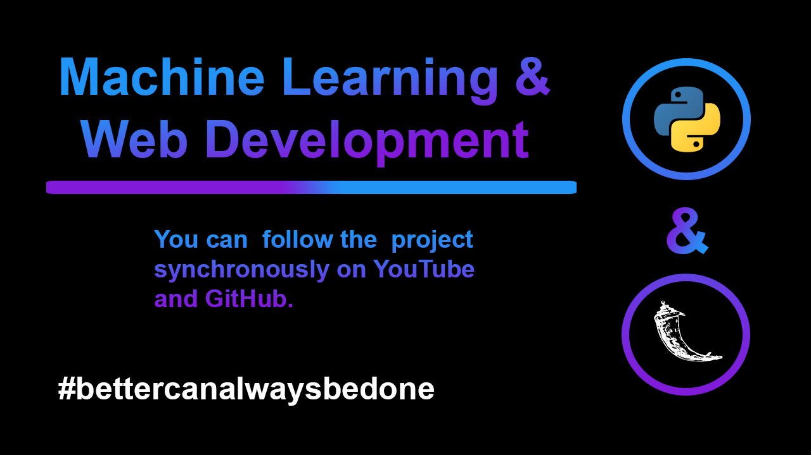

## Machine Learning & Web Development

****

## YouTube Channel & Videos

****

- [YouTube Channel](https://www.youtube.com/SelmanBaskaya)
- [Tanıtım | Kanal İçeriği | Machine Learning & Web Development Projesi #0](https://www.youtube.com/watch?v=BkprXbS6tA4)
- [Veri Tipleri, Kolon ve Encoding İşlemleri](https://www.youtube.com/watch?v=uba0iHWMsCY)
- [train_test_split() - Linear Regression - statsmodels](https://www.youtube.com/watch?v=IPCLX1E0mo4)
- [Pickle Nedir? İlk Flask App'imizi Oluşturalım](https://youtu.be/0q8qrOZSILM)
- [Flask ile Web Uygulaması Arayüzünü Hazırlama ](https://www.youtube.com/watch?v=C3kfPjJH0CU)
- [Flask Uygulamasında ML Modelinden Tahmin Değeri Alma ](https://www.youtube.com/watch?v=lWv0952Yd-I)

****

## ToDo List
### Machine Learning
- [x] Data labeling
- [x] Data preparation
- [x] Training of the ML Model
- [x] Optimization of ML Model

### Web Application
- [x] Install Flask
- [x] Designing the interface
- [x] Coding the interface

### Integration of Machine Learning and Web Application
- [x] Creation of Pickle file for ML model
- [x] Affecting the web application with parameters

### Bonus
- [ ] Deploy on Heroku

****

## Author
**Selman Baskaya**

Follow me on [Twitter](https://twitter.com/selmanbaskaya)

Follow me on [Medium](https://medium.com/@selmanbaskaya)
