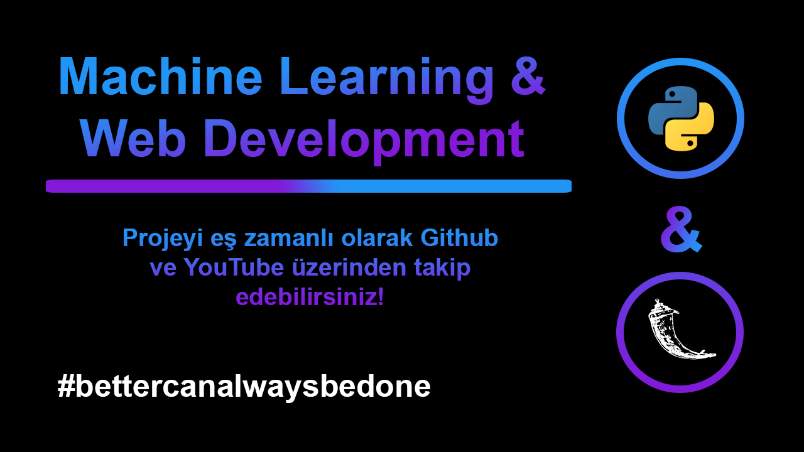

## Machine Learning & Web Development

****

## ToDo List
### Machine Learning
- [ ] Veri etiketleme
- [ ] Veri hazırlama
- [ ] Modelin eğitimi
- [ ] Modelin optimize edilmesi

### Web Application
- [ ] Flask kurulumu
- [ ] Arayüzün tasarlanması
- [ ] Arayüzün kodlanması

### Integration of Machine Learning and Web Application
- [ ] ML modeli için Pickle dosyasının oluşturulması
- [ ] Parametrelerin modele gönderilmesi ve web uygulamasının etkilenmesi

### Bonus
- [ ] Heroku deploy

****

## Author
**Selman Baskaya**

Follow me on [Twitter](https://twitter.com/selmanbaskaya)

Follow me on [Medium](https://medium.com/@selmanbaskaya)
